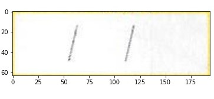

## The main function used to get the ROI from thw query Image is get_vaccination_roi(), which take queryImage, templateImage, coordinates as arguement. This function calls 2 functions:
### performHomography()
performHomography() take 2 arguement queryImage, templateImage. First we use SIFT for fetaure detection, which returns the keypoint and descriptors for bothe Images. Then using the descriptor we match the keypoints, using the matching keypoint we find the Homography matrix. Then we transform the Query image using the obtained Hoography matrix and finally return the alligned Image
### extractRoi()
extractRoi() takes 3 Arguemnets alignedImage, templateImage, coordinates. For extracting the ROI, let the area of ROI be H`x`W,  we take a small neighbourhood area around the ROI, in particular the small area contains the pixel represnting the name of Vaccine, I did this by moving my upper left corner by 120 pixels to the left, so my new ROI has area H`x`(W+120) . This is like increasing field of view. After this I use this new ROI as a template for matching in the Aligned Image. From the Aligned Image, I took extra area of 25 pixel on eah side of the new ROI. Then I psed this as a template matching problem. After which I got the matching ROI, simillar to new area, I finally cropped the matching area to original ROI and returned it.

Suppose ROI from the Template Images is\
\
We add neigbourhood area to this file, so the new ROI of the template Image is\
\
Then we take the following area from Query image to find a match\

# Libraries used:
### OpenCv, Matplotlib, Numpy
